# Know Your Agent (KYA): A Visual Guide
## The Identity Layer for Autonomous AI Agents

---

# The Problem: Agents Can't Show ID

AI agents are transacting at scale. Coinbase's x402 protocol has processed $24 million in agent payments. Olas has executed 3.5 million+ agent transactions. But here's the issue:

```
┌─────────────────────────────────────────────────────────────────┐
│                     HUMAN ENTERS A BANK                         │
├─────────────────────────────────────────────────────────────────┤
│                                                                 │
│   Human ──── shows ────► Passport ────► Bank verifies           │
│              │                              │                   │
│              └── biometrics ──────────────► ✓ Identity confirmed│
│              └── address proof ───────────► ✓ KYC complete      │
│                                                                 │
│   Result: Human can transact                                    │
│                                                                 │
└─────────────────────────────────────────────────────────────────┘

┌─────────────────────────────────────────────────────────────────┐
│                     AGENT ENTERS A BANK                         │
├─────────────────────────────────────────────────────────────────┤
│                                                                 │
│   Agent ──── shows ────► ???                                    │
│              │                                                  │
│              └── no passport ─────────────► ✗                   │
│              └── no biometrics ───────────► ✗                   │
│              └── no address ──────────────► ✗                   │
│                                                                 │
│   Result: ¯\_(ツ)_/¯                                            │
│                                                                 │
└─────────────────────────────────────────────────────────────────┘
```

**KYA solves this by creating a passport system for AI agents.**

---

# The Core Concept: Attestation Chains

KYA uses the Ethereum Attestation Service (EAS) to create verifiable credentials. Think of attestations as notarized statements that anyone can verify cryptographically.

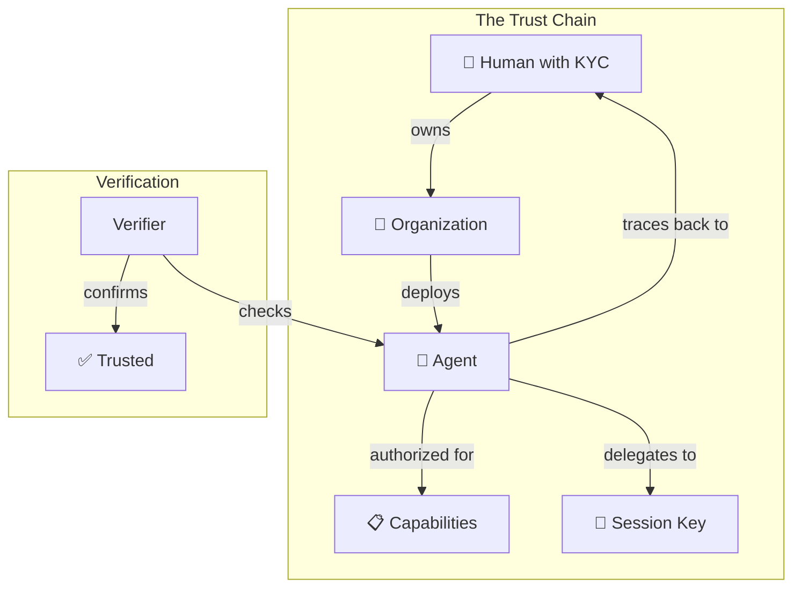

**Every agent traces back to a human. Always.**

---

# The Four Schemas: KYA's Building Blocks

KYA defines four types of attestations that compose together:

```
┌─────────────────────────────────────────────────────────────────────┐
│                        KYA SCHEMA ARCHITECTURE                       │
├─────────────────────────────────────────────────────────────────────┤
│                                                                     │
│   ┌──────────────┐                                                  │
│   │   IDENTITY   │◄─── "Who is this agent?"                         │
│   │              │     • Agent's wallet address                     │
│   │   (Schema 1) │     • Owner's address (THE ACCOUNTABILITY HOOK)  │
│   └──────┬───────┘     • Unique identifier (DID)                    │
│          │                                                          │
│          │ references                                               │
│          ▼                                                          │
│   ┌──────────────┐                                                  │
│   │  CAPABILITY  │◄─── "What can it do?"                            │
│   │              │     • Permission flags (transact, sign, etc.)    │
│   │   (Schema 2) │     • Spending limits                            │
│   └──────┬───────┘     • Expiration time                            │
│          │                                                          │
│          │ references                                               │
│          ▼                                                          │
│   ┌──────────────┐                                                  │
│   │  DELEGATION  │◄─── "Who authorized this?"                       │
│   │              │     • Delegator → Delegatee                      │
│   │   (Schema 4) │     • Scope of delegation                        │
│   └──────────────┘     • Depth limit (max 3 levels)                 │
│                                                                     │
│   ┌──────────────┐                                                  │
│   │  PROVENANCE  │◄─── "Where did it come from?"                    │
│   │              │     • Source code hash                           │
│   │   (Schema 3) │     • Model weights hash                         │
│   └──────────────┘     • Audit reports                              │
│                                                                     │
└─────────────────────────────────────────────────────────────────────┘
```

---

# Schema 1: KYA-Identity

**The agent's passport. Answers: "Who is this and who's responsible?"**

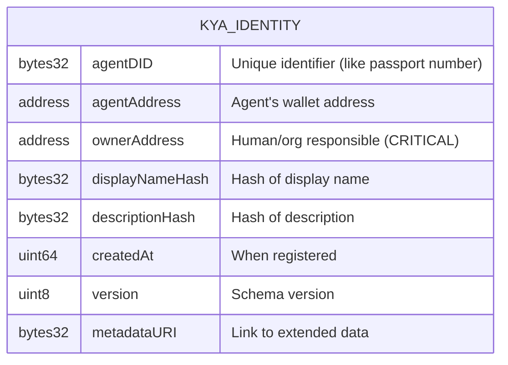

**The Key Field: `ownerAddress`**

```
┌────────────────────────────────────────────────────────┐
│                  ACCOUNTABILITY CHAIN                   │
├────────────────────────────────────────────────────────┤
│                                                        │
│   Agent Wallet: 0xABCD...                              │
│        │                                               │
│        │ ownerAddress points to                        │
│        ▼                                               │
│   Owner: 0x1234... (Human or Company)                  │
│        │                                               │
│        │ has verified                                  │
│        ▼                                               │
│   KYC/KYB Credential ✓                                 │
│                                                        │
│   ══════════════════════════════════════════════════   │
│   When agent misbehaves → trace to owner → legal       │
│   accountability exists                                │
│                                                        │
└────────────────────────────────────────────────────────┘
```

---

# Schema 2: KYA-Capability

**The agent's security clearance. Answers: "What actions are authorized?"**

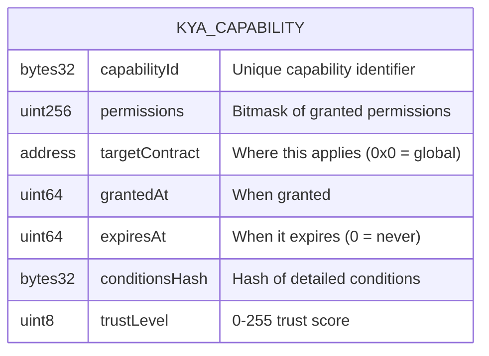

**Permission Bitmask Explained:**

```
┌─────────────────────────────────────────────────────────────────┐
│                    PERMISSION BITMASK                            │
├─────────────────────────────────────────────────────────────────┤
│                                                                 │
│   Bit 0:  TRANSACT      [1 = can execute financial txns]        │
│   Bit 1:  SIGN          [1 = can sign messages]                 │
│   Bit 2:  DEPLOY        [1 = can deploy contracts]              │
│   Bit 3:  ADMIN         [1 = admin operations]                  │
│   Bit 4:  READ_PRIVATE  [1 = can access private data]           │
│   Bit 5:  DELEGATE      [1 = can delegate to sub-agents]        │
│   Bit 6:  CROSS_CHAIN   [1 = can operate across chains]         │
│                                                                 │
│   Example: permissions = 0b00000011 (binary) = 3 (decimal)      │
│            → Agent can TRANSACT + SIGN, nothing else            │
│                                                                 │
└─────────────────────────────────────────────────────────────────┘
```

**Conditions Document (stored off-chain):**

```json
{
  "spendingLimits": {
    "perTransaction": "1000 USDC",
    "dailyAggregate": "10000 USDC"
  },
  "temporalConstraints": {
    "validHours": [9, 17],
    "validDays": [1, 2, 3, 4, 5]
  },
  "geographicConstraints": {
    "excludedCountries": ["KP", "IR"]
  }
}
```

---

# Schema 3: KYA-Provenance

**The agent's DNA test + family tree. Answers: "Where did this code come from?"**

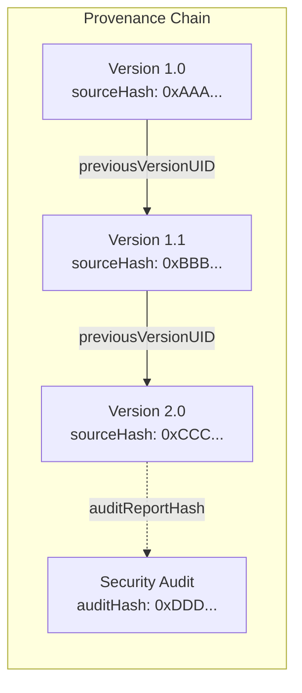

```
┌─────────────────────────────────────────────────────────────────┐
│                    PROVENANCE ATTESTATION                        │
├─────────────────────────────────────────────────────────────────┤
│                                                                 │
│   sourceCodeHash ──► "This is the exact code running"           │
│   modelHash ───────► "This is the AI model being used"          │
│   buildHash ───────► "This is the compiled artifact"            │
│   builderAddress ──► "This address built/deployed it"           │
│   auditReportHash ─► "This audit was performed"                 │
│                                                                 │
│   previousVersionUID ──► Links to prior version                 │
│                          (creates auditable history)            │
│                                                                 │
└─────────────────────────────────────────────────────────────────┘
```

**Why it matters:** When an agent behaves unexpectedly, you can verify exactly what code it was running and trace its entire development history.

---

# Schema 4: KYA-Delegation

**The agent's power of attorney. Answers: "Who granted these permissions?"**

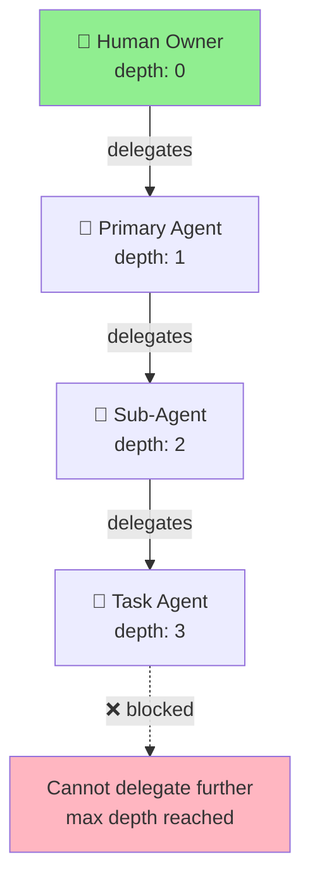

```
┌─────────────────────────────────────────────────────────────────┐
│                    DELEGATION DEPTH LIMITS                       │
├─────────────────────────────────────────────────────────────────┤
│                                                                 │
│   Human (depth 0)                                               │
│      │                                                          │
│      └──► Agent A (depth 1) ✓                                   │
│              │                                                  │
│              └──► Agent B (depth 2) ✓                           │
│                      │                                          │
│                      └──► Agent C (depth 3) ✓                   │
│                              │                                  │
│                              └──► Agent D (depth 4) ✗ BLOCKED   │
│                                                                 │
│   Why? Unbounded delegation chains obscure accountability.      │
│   At some point, you've lost track of who's really responsible. │
│                                                                 │
└─────────────────────────────────────────────────────────────────┘
```

---

# How The Schemas Connect: The Attestation Graph

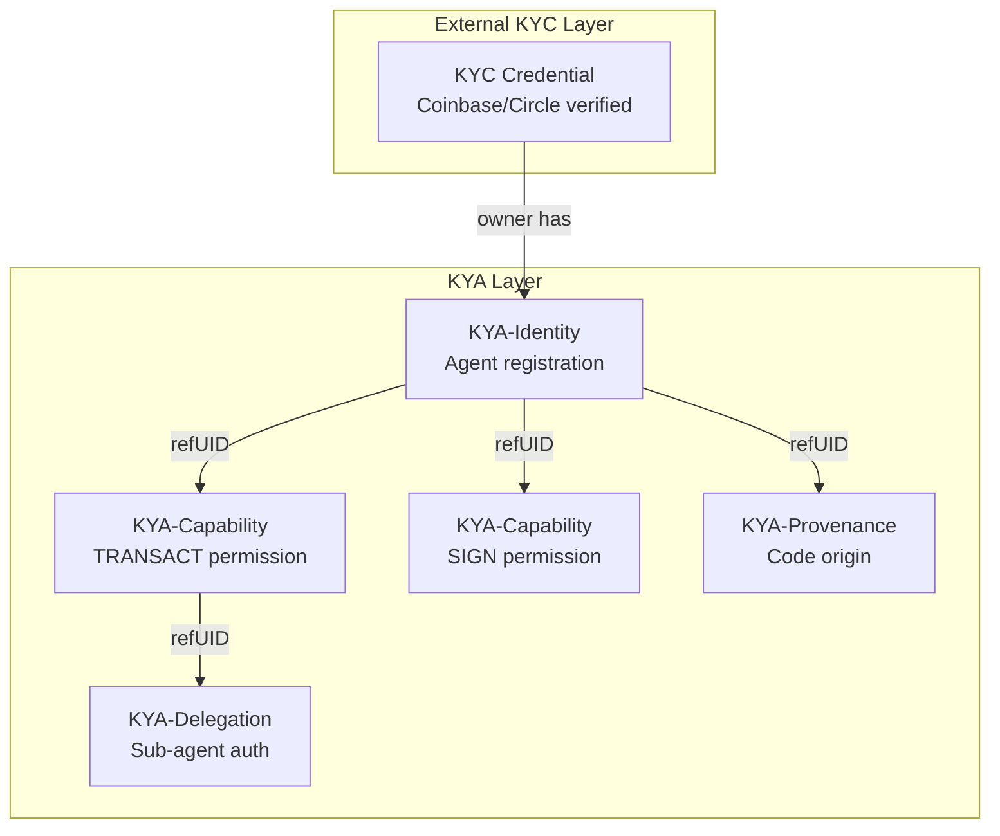

**Every capability references an identity. Every delegation traces back to a human.**

---

# The Verification Flow

When a service receives a request from an agent:

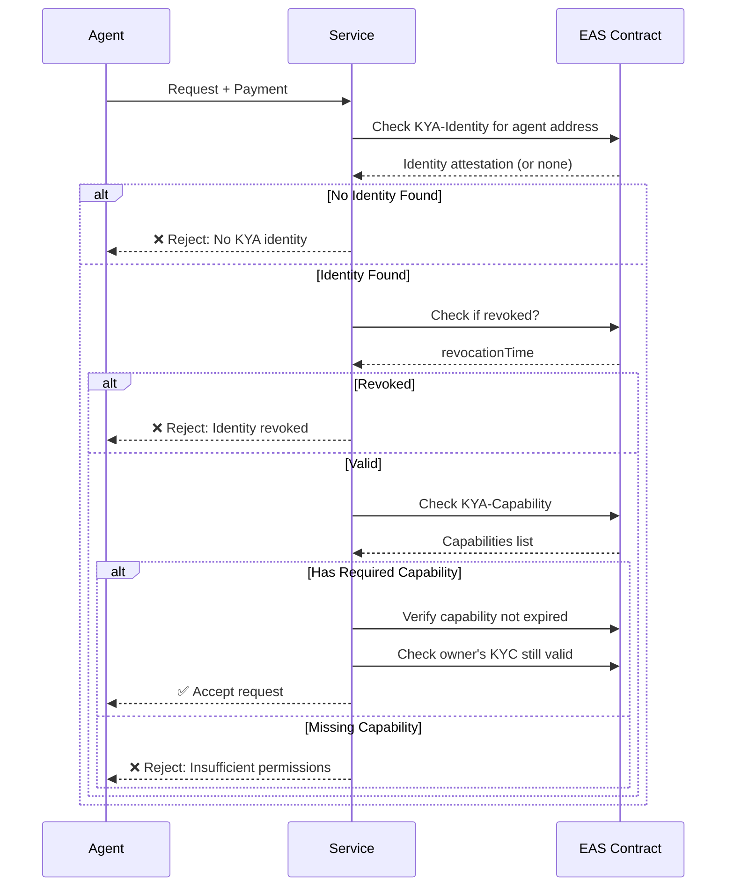

---

# On-Chain vs. Off-Chain Attestations

```
┌─────────────────────────────────────────────────────────────────┐
│              ON-CHAIN vs OFF-CHAIN ATTESTATIONS                  │
├─────────────────────────────────────────────────────────────────┤
│                                                                 │
│   ON-CHAIN                        OFF-CHAIN                     │
│   ════════                        ═════════                     │
│   • Stored on blockchain          • Stored elsewhere (IPFS, DB) │
│   • Costs gas (~$0.02 on L2)      • Free to create              │
│   • Instant smart contract access • Requires fetch + verify     │
│   • Permanent, immutable          • Flexible, updateable        │
│                                                                 │
│   USE FOR:                        USE FOR:                      │
│   • Core identity                 • Behavioral records          │
│   • Critical capabilities         • Session credentials         │
│   • Anything contracts need       • High-frequency updates      │
│                                                                 │
│   ┌─────────────────────────────────────────────────────────┐   │
│   │                  HYBRID APPROACH                         │   │
│   │                                                         │   │
│   │   Identity ──────► ON-CHAIN (created once, permanent)   │   │
│   │   Core Capabilities ► ON-CHAIN (contracts check these)  │   │
│   │   Detailed Conditions ► OFF-CHAIN (flexible, detailed)  │   │
│   │   Behavioral Data ──► OFF-CHAIN (high volume, cheap)    │   │
│   │   Revocation ───────► ON-CHAIN (must be global/instant) │   │
│   │                                                         │   │
│   └─────────────────────────────────────────────────────────┘   │
│                                                                 │
└─────────────────────────────────────────────────────────────────┘
```

---

# Resolver Contracts: The Gatekeepers

Resolvers enforce rules when attestations are created:

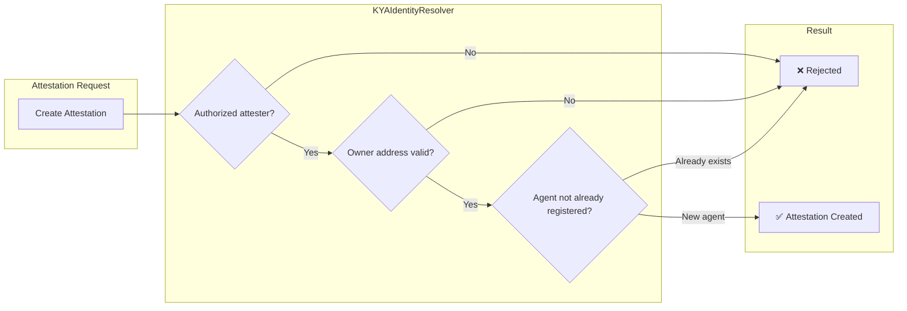

```
┌─────────────────────────────────────────────────────────────────┐
│                    RESOLVER RESPONSIBILITIES                     │
├─────────────────────────────────────────────────────────────────┤
│                                                                 │
│   KYAIdentityResolver:                                          │
│   ├── Only authorized issuers can create identities             │
│   ├── One identity per agent address (no duplicates)            │
│   └── Owner address cannot be empty                             │
│                                                                 │
│   KYACapabilityResolver:                                        │
│   ├── Must reference valid, non-revoked identity                │
│   └── Parent identity must not be expired                       │
│                                                                 │
│   KYADelegationResolver:                                        │
│   ├── Depth cannot exceed maximum (default: 3)                  │
│   └── Delegator must have DELEGATE permission                   │
│                                                                 │
└─────────────────────────────────────────────────────────────────┘
```

---

# Integration: How KYA Plugs Into The Ecosystem

## x402 Protocol (Agent Payments)

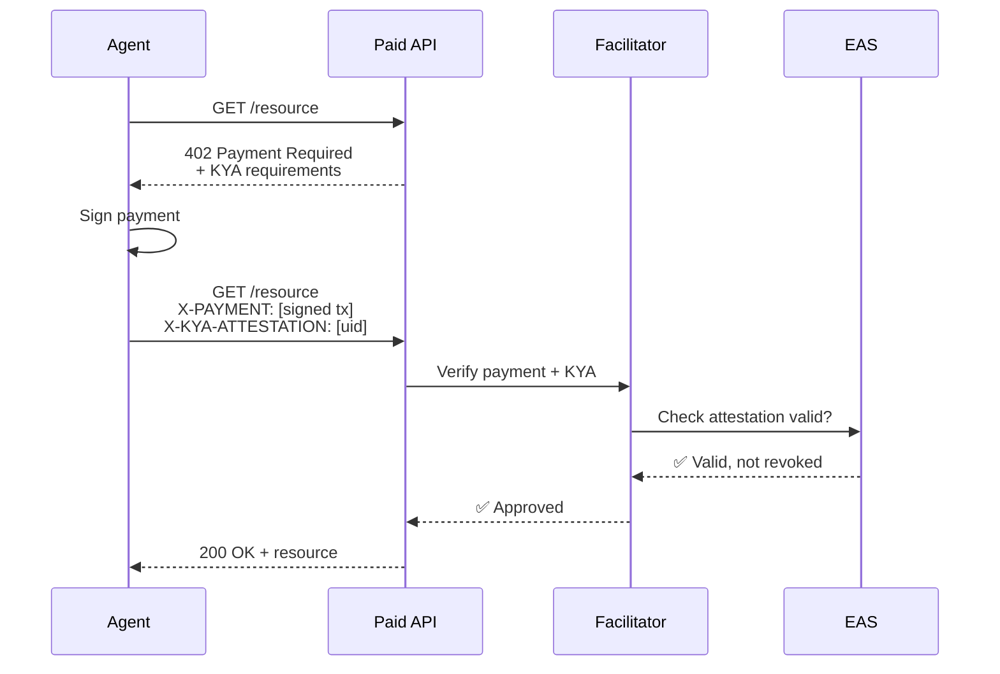

## Kite.ai Integration

```
┌─────────────────────────────────────────────────────────────────┐
│                    KITE + KYA INTEGRATION                        │
├─────────────────────────────────────────────────────────────────┤
│                                                                 │
│   ┌─────────────┐         ┌─────────────┐                       │
│   │  KitePass   │◄───────►│ KYA-Identity│                       │
│   │  (Kite's    │  links  │ (Portable   │                       │
│   │   native    │   to    │  across     │                       │
│   │   identity) │         │  platforms) │                       │
│   └─────────────┘         └─────────────┘                       │
│                                                                 │
│   Before session key derivation:                                │
│   1. Check KitePass exists                                      │
│   2. Check linked KYA-Identity valid                            │
│   3. Check KYA-Capability includes required permissions         │
│   4. If all pass → derive session key                           │
│                                                                 │
└─────────────────────────────────────────────────────────────────┘
```

---

# The Design Principles Visualized

```
┌─────────────────────────────────────────────────────────────────┐
│                    KYA DESIGN PRINCIPLES                         │
├─────────────────────────────────────────────────────────────────┤
│                                                                 │
│   1. COMPOSABILITY OVER MONOLITHISM                             │
│   ┌─────┐ ┌─────┐ ┌─────┐ ┌─────┐                               │
│   │ ID  │+│ CAP │+│PROV │+│ DEL │ = Complete Profile            │
│   └─────┘ └─────┘ └─────┘ └─────┘                               │
│   Small pieces combine. Use only what you need.                 │
│                                                                 │
│   2. PROGRESSIVE TRUST                                          │
│   ○───────○───────○───────●                                     │
│   New    Basic   Verified  Trusted                              │
│   Agent   ID      + Caps   + Audits                             │
│   Start minimal, accumulate credentials over time.              │
│                                                                 │
│   3. HUMAN ACCOUNTABILITY ANCHORING                             │
│   Agent → Agent → Agent → Agent → 👤 HUMAN                      │
│   Every chain terminates at a responsible party.                │
│   NON-NEGOTIABLE.                                               │
│                                                                 │
│   4. REVOCATION AS FIRST-CLASS CITIZEN                          │
│   [VALID] ───revoke()───► [REVOKED]                             │
│   Instant. Global. Permanent. No using revoked credentials.     │
│                                                                 │
└─────────────────────────────────────────────────────────────────┘
```

---

# Quick Reference Card

```
┌─────────────────────────────────────────────────────────────────┐
│                     KYA QUICK REFERENCE                          │
├─────────────────────────────────────────────────────────────────┤
│                                                                 │
│  SCHEMA          PURPOSE              KEY QUESTION              │
│  ───────────────────────────────────────────────────────────    │
│  Identity        Agent's passport     "Who is this?"            │
│  Capability      Security clearance   "What can it do?"         │
│  Provenance      DNA + family tree    "Where did it come from?" │
│  Delegation      Power of attorney    "Who authorized it?"      │
│                                                                 │
│  ═══════════════════════════════════════════════════════════    │
│                                                                 │
│  BUILT ON: Ethereum Attestation Service (EAS)                   │
│  DEPLOYED: Base, Optimism, Arbitrum, Ethereum mainnet           │
│  COST: ~$0.02 per attestation on L2                             │
│                                                                 │
│  ═══════════════════════════════════════════════════════════    │
│                                                                 │
│  THE ONE RULE: Every chain ends at a human.                     │
│                                                                 │
└─────────────────────────────────────────────────────────────────┘
```

---

# The Pitch (When Someone Asks "What is KYA?")

> "KYA is a passport system for AI agents. Humans have KYC—Know Your Customer. 
> Agents need KYA—Know Your Agent.
>
> The problem: AI agents are already transacting billions, but they can't prove 
> who they are, what they're authorized to do, or who's responsible when they 
> fail. You can't ask an AI for a passport.
>
> KYA solves this with four composable attestation schemas—Identity, Capability, 
> Provenance, and Delegation—built on infrastructure that already exists and is 
> trusted (Ethereum Attestation Service).
>
> The key insight: every agent identity chain must terminate at a human. 
> That's how you maintain accountability in a world of autonomous systems."

---

# Comparison: KYA vs. Alternatives

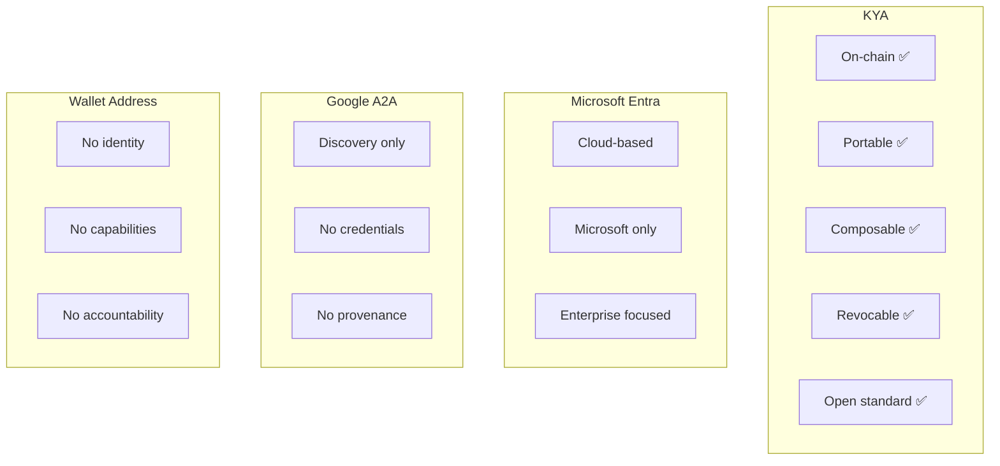

```
┌────────────────────────────────────────────────────────────────────────┐
│                    FEATURE COMPARISON MATRIX                            │
├────────────────────────────────────────────────────────────────────────┤
│                                                                        │
│   Feature              │ KYA │ Entra │ A2A │ ERC-8004 │ Wallet Only    │
│   ─────────────────────┼─────┼───────┼─────┼──────────┼────────────    │
│   On-chain verify      │  ✅  │   ❌   │  ❌  │    ✅     │     ❌         │
│   Portable creds       │  ✅  │   ❌   │  ⚠️  │    ✅     │     ❌         │
│   Capability attests   │  ✅  │   ✅   │  ⚠️  │    ❌     │     ❌         │
│   Provenance chain     │  ✅  │   ❌   │  ❌  │    ⚠️     │     ❌         │
│   Delegation tracking  │  ✅  │   ✅   │  ❌  │    ❌     │     ❌         │
│   On-chain revocation  │  ✅  │   ❌   │  ❌  │    ⚠️     │     ❌         │
│   Open/permissionless  │  ✅  │   ❌   │  ✅  │    ✅     │     ✅         │
│                                                                        │
│   ✅ = Full support  ⚠️ = Partial  ❌ = Not supported                    │
│                                                                        │
└────────────────────────────────────────────────────────────────────────┘
```

---

# Why Now? Market Timing

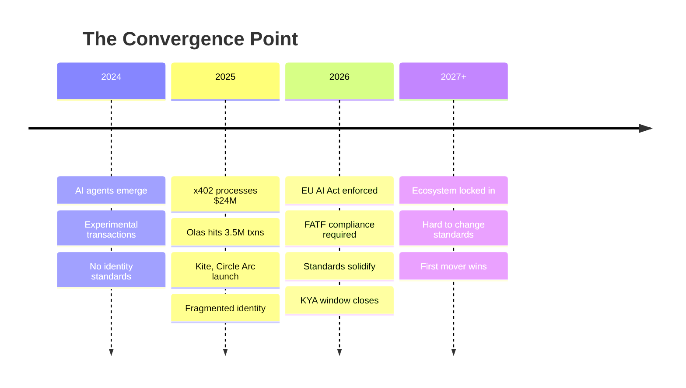

**The window for establishing agent identity standards is 2025-2026. After that, fragmentation becomes permanent.**

---

# Conclusion: The Core Insight

```
┌─────────────────────────────────────────────────────────────────┐
│                                                                 │
│   "Agent identity is fundamentally different from human         │
│    identity. You can't ask an AI for a passport.                │
│                                                                 │
│    But you still need answers to:                               │
│                                                                 │
│    • Who authorized this agent?                                 │
│    • What can it do?                                            │
│    • Who's accountable when it fails?                           │
│                                                                 │
│    KYA provides cryptographically verifiable answers,           │
│    built on infrastructure that already exists and is trusted." │
│                                                                 │
└─────────────────────────────────────────────────────────────────┘
```

---

*KYA is an open specification. Contributions welcome.*
