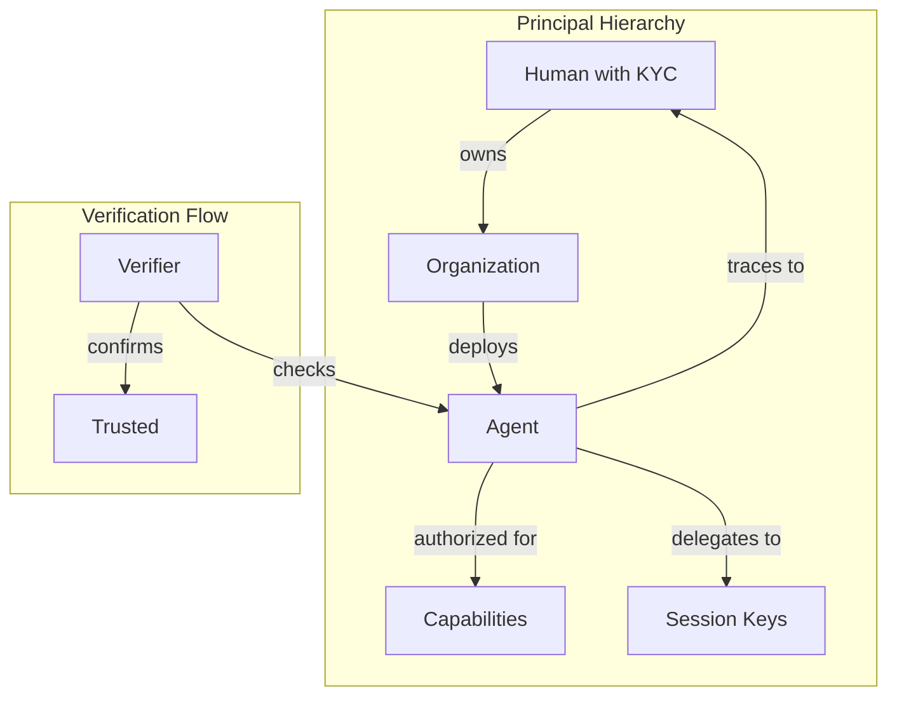

<p align="center">
  
  
  
</p>

<h1 align="center">KYA Protocol</h1>

<p align="center">
  <strong>Know Your Agent</strong><br/>
  An on-chain identity standard for autonomous AI agents built on the Ethereum Attestation Service
</p>

<p align="center">
  <a href="#the-problem">Problem</a> •
  <a href="#the-solution">Solution</a> •
  <a href="#architecture">Architecture</a> •
  <a href="#quick-start">Quick Start</a> •
  <a href="#roadmap">Roadmap</a>
</p>

---

> **Warning**
> This specification is in **DRAFT** status. Schema definitions, resolver contracts, and SDK interfaces are subject to change. Not recommended for production use.

---

## The Problem

AI agents are transacting at unprecedented scale:

| Metric | Value | Source |
|--------|-------|--------|
| Agent payments processed | **$24M+** | x402 Protocol (Coinbase) |
| Agent transactions | **3.5M+** | Olas Protocol |
| Safe transactions from agents | **75%** | Gnosis Chain |

Yet agents remain **"unbanked ghosts"** — unable to prove:
- Who they are
- What they're authorized to do
- Who's accountable when they fail

**Humans have KYC. Agents need KYA.**

## The Solution

KYA provides a composable attestation framework that answers the four critical questions for any autonomous agent:

```
┌──────────────────────────────────────────────────────────────────┐
│                        KYA TRUST CHAIN                           │
├──────────────────────────────────────────────────────────────────┤
│                                                                  │
│   IDENTITY ────► CAPABILITY ────► DELEGATION ────► PROVENANCE    │
│   "Who?"         "What?"          "By whom?"       "From where?" │
│                                                                  │
│   Every chain terminates at a human. Always.                     │
│                                                                  │
└──────────────────────────────────────────────────────────────────┘
```

### The Four Schemas

| Schema | Purpose | Key Question |
|--------|---------|--------------|
| **KYA-Identity** | Agent's passport | "Who is this agent?" |
| **KYA-Capability** | Security clearance | "What can it do?" |
| **KYA-Provenance** | Code lineage | "Where did it come from?" |
| **KYA-Delegation** | Authority chain | "Who authorized it?" |

## Architecture

### Built on Battle-Tested Infrastructure

KYA leverages the [Ethereum Attestation Service (EAS)](https://attest.sh) — a permissionless, tokenless public good already trusted by:

- **Coinbase Verifications** — 77,000+ verified users on Base
- **Gitcoin Passport** — 2M+ users, 34M+ credentials
- **Deployed everywhere** — Base, Optimism, Arbitrum, Ethereum mainnet

### Trust Model



### On-Chain vs Off-Chain

| Attestation Type | Storage | Cost (L2) | Use Case |
|-----------------|---------|-----------|----------|
| **Identity** | On-chain | ~$0.02 | Core registration |
| **Capability** | On-chain | ~$0.02 | Permission grants |
| **Provenance** | Off-chain | Free | Code history |
| **Behavioral** | Off-chain | Free | Reputation data |

## Quick Start

```typescript
import { KYA } from '@kya/sdk';

// Initialize with signer
const kya = new KYA({
  network: 'base',
  signer: yourSigner
});

// Register agent identity
const identityUID = await kya.createIdentity({
  agentAddress: '0xAgent...',
  ownerAddress: '0xHuman...',  // Accountability anchor
  displayName: 'TradingBot Alpha',
  agentType: 'defi-trader'
});

// Grant capabilities
await kya.addCapability({
  parentIdentity: identityUID,
  permissions: KYA.Permissions.TRANSACT | KYA.Permissions.SIGN,
  spendingLimit: ethers.parseEther('1000'),
  expiresAt: Date.now() + 86400 * 30 * 1000  // 30 days
});

// Verify an agent
const isValid = await kya.verify({
  agentAddress: '0xAgent...',
  requiredCapabilities: ['TRANSACT'],
  minimumTrustScore: 50
});
```

## Integration Targets

KYA is designed to integrate with the emerging agent commerce stack:

| Protocol | Integration | Status |
|----------|-------------|--------|
| **x402** (Coinbase) | Payment verification with KYA attestations | Planned |
| **Kite.ai** | KitePass credential linking | Planned |
| **Circle Arc** | Compliance module integration | Planned |
| **Stripe Tempo** | SPT credential references | Research |

## Documentation

| Document | Description |
|----------|-------------|
| **[SPECIFICATION.md](./SPECIFICATION.md)** | Technical spec — schemas, resolvers, SDK patterns |
| **[WHITEPAPER.md](./WHITEPAPER.md)** | Market context, protocol landscape, adoption pathways |

## Roadmap

### Phase 1: Foundation (Q1 2025)
- [x] Schema design and specification
- [x] Whitepaper publication
- [ ] Schema deployment on Base Sepolia
- [ ] Resolver contract implementation

### Phase 2: SDK & Tooling (Q2 2025)
- [ ] TypeScript SDK (`@kya/sdk`)
- [ ] Verification utilities
- [ ] Integration examples

### Phase 3: Ecosystem (Q3 2025)
- [ ] x402 integration PR
- [ ] Kite.ai partnership
- [ ] Mainnet deployment

### Phase 4: Standards (Q4 2025)
- [ ] EIP submission
- [ ] Industry working group
- [ ] Compliance framework alignment

## Why Now?

The window for establishing agent identity standards is **2025-2026**:

- **EU AI Act** enforcement begins August 2026
- **FATF** compliance requirements expanding to programmatic actors
- **First-mover advantage** in defining the trust layer

After that, fragmentation becomes permanent.

## Contributing

KYA is an open specification. We welcome:

- **Feedback** on schema design
- **Integration proposals** from protocol teams
- **Security reviews** of resolver contracts
- **Use case documentation**

See [CONTRIBUTING.md](./CONTRIBUTING.md) for guidelines.

## Security

This is alpha software. **Do not use in production.**

To report security issues, please email security@edgeoftrust.com.

## License

MIT License — See [LICENSE](./LICENSE)

---

<p align="center">
  <em>The agents are coming. It's time to know who they are.</em>
</p>

<p align="center">
  <sub>Built with conviction by <a href="https://edgeoftrust.com">Edge of Trust</a></sub>
</p>
